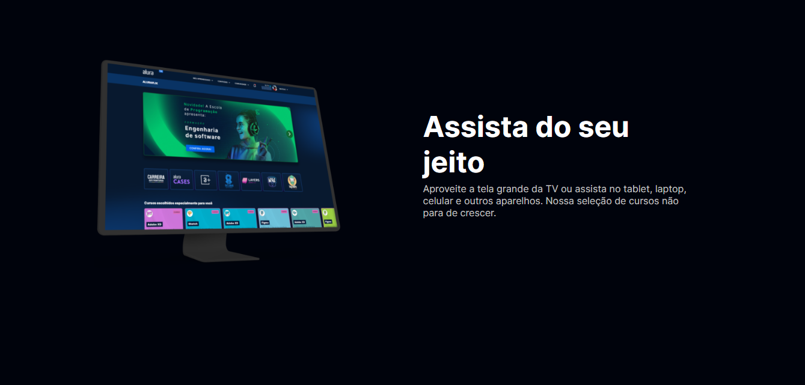
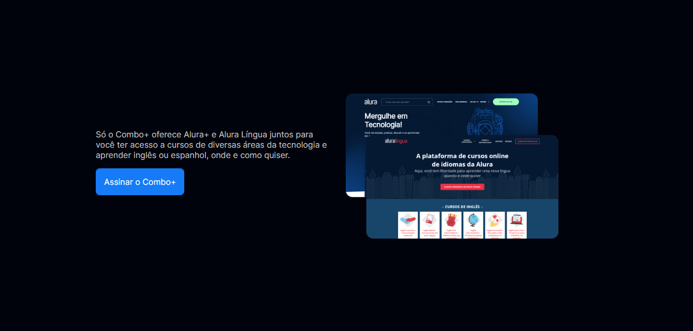
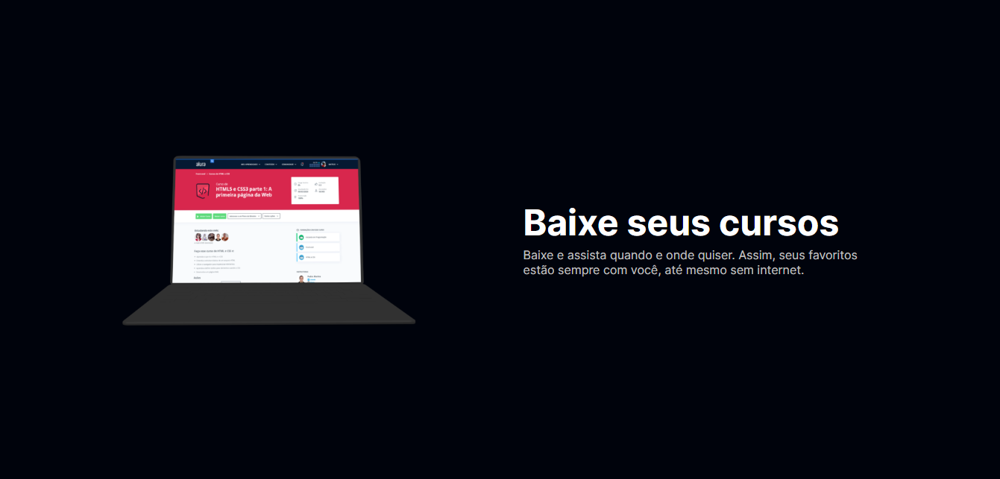
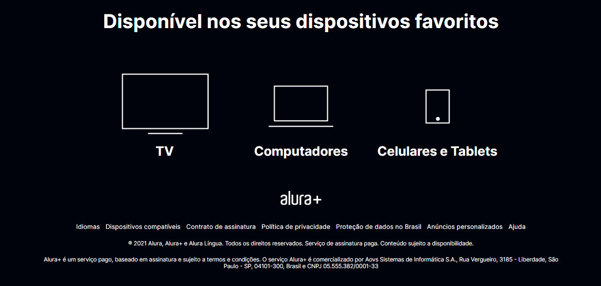

<h1 align="center"> Praticando HTML/CSS - Alura Plus</h1>

 Projeto desenvolvido no curso de Prática de HTML e CSS da Alura. 

  <a href="#-tecnologias">Tecnologias</a>&nbsp;&nbsp;&nbsp;|&nbsp;&nbsp;&nbsp;
  <a href="https://github.com/gabriel-adsv/alura-plus">Projeto</a>&nbsp;&nbsp;&nbsp;|&nbsp;&nbsp;&nbsp;
  <a href="https://gabriel-adsv.github.io/alura-plus/" target="_blank">Layout</a>&nbsp;&nbsp;&nbsp;|&nbsp;&nbsp;&nbsp;
  <a href="#memo-licença">Licença</a>

  

 

  
  
  
  
  

## 🚀 Tecnologias
Esse projeto foi desenvolvido com as seguintes tecnologias:
- HTML
- CSS: Flexbox, Flex-containers, flex-itens, flex-direction
- Pseudo-classes no CSS: hover e active

## 💻 Projeto
Atividade feita no desafio proposto pela Rocketseat. 
- [Acesse o projeto finalizado, online](https://gabriel-adsv.github.io/alura-plus/)

## 📝 Licença
Esse projeto está sob a licença MIT.

---
Feito com ♥ by Gabriel Augusto